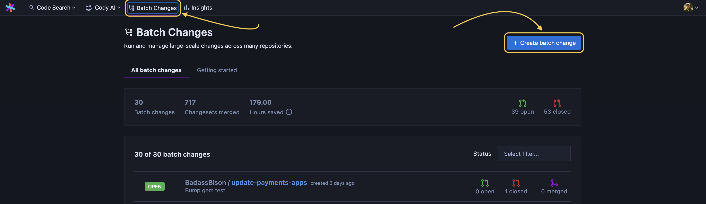
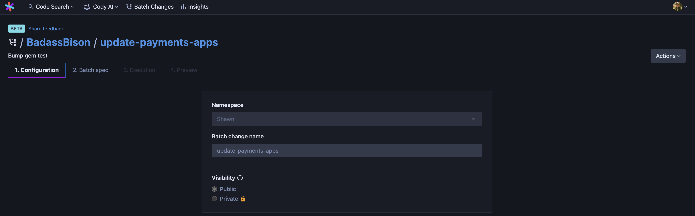
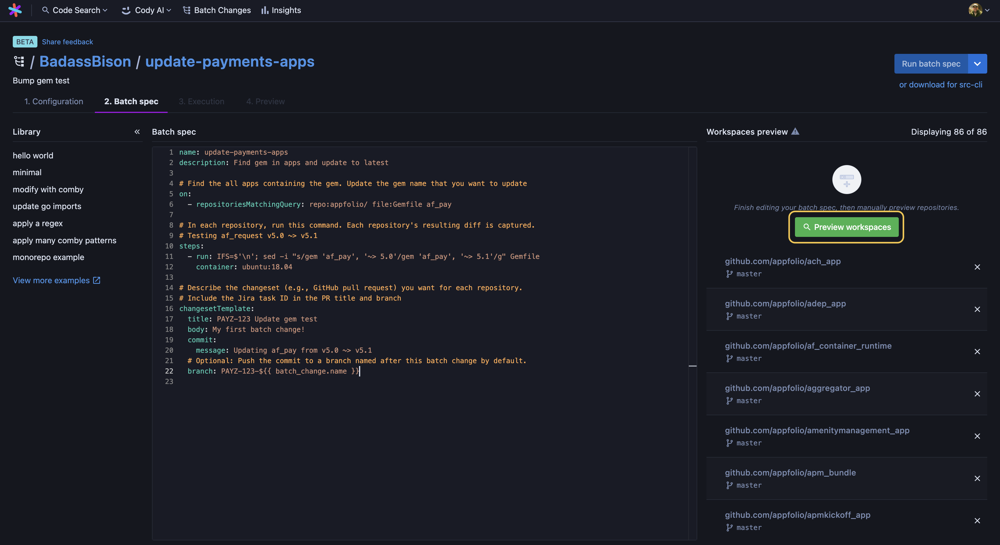
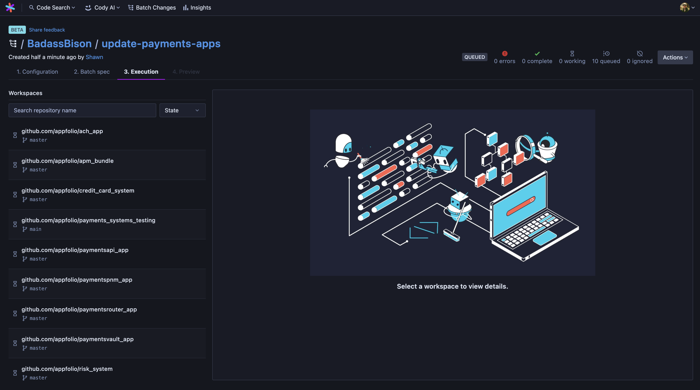
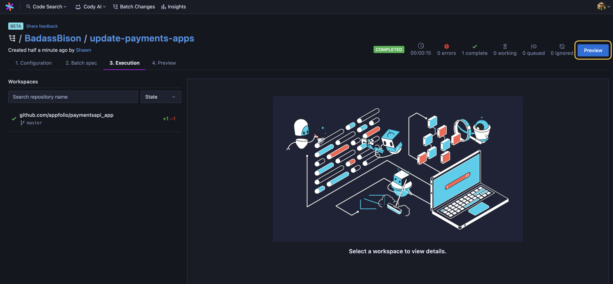
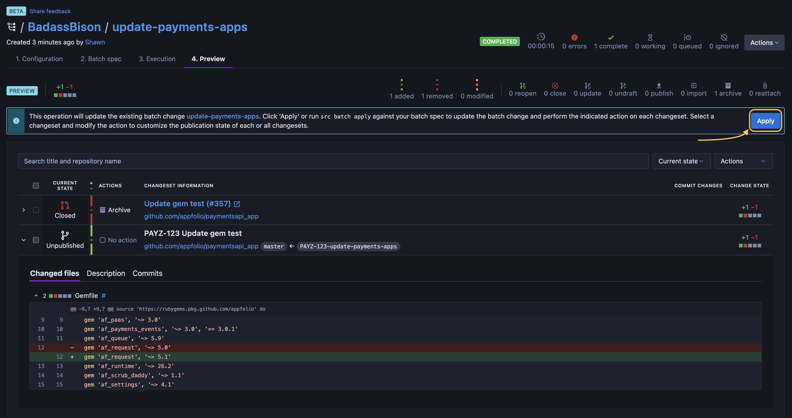

# Releasing the gem

This uses [Gem Releaser](https://developer.appf.io/docs/default/Component/gem-releaser/) for releasing.
Gem Releaser assumes you are using [Conventional Commit messages](https://www.conventionalcommits.org/en/v1.0.0/).

## Workflow

1. Update gem and merge the PR when ready (don't update the version)
1. A release PR will be auto generated with
  1. version update based on commits
  1. changelog updates
1. Merge the release PR if everything is good. The gem will release automatically

!!! tip "Conventional commit prefixes"

    The most important commit prefixes are:

    * **fix:** which represents bug fixes, and correlates to a SemVer patch.
    * **feat:, chore:, refactor:, docs:,** etc., correlates to a SemVer minor.
    * **feat!:, fix!:, refactor!:,** etc., which represent a breaking change (indicated by the !) and will result in a SemVer major.

    You can review the the list of commit prefixes in `./release-please-config.json` under `changelog-sections`

## Updating apps dependent on this Gem

[Sourcegraph](https://docs.sourcegraph.com/) is the easiest way to detect all apps using the Gem and update them using batch changes.

[Developer Portal Documentation](https://developer.appf.io/docs/default/Resource/appfolio-software-development-guide/developer_guide/tools/sourcegraph/)

For batch changes, you will need a Github PAT (Personal Access Token) with specific priviledges and Github needs to authorize Sourcegraph. Sourcegraph will prompt you for what you need if it's your first time

1. Login into [Appfolio's Sourcegraph instance](https://sourcegraph.appf.io/) with Github
1. Search for the Gem using something similair to this example query `context:global repo:appfolio file:Gemfile af_pay`. Verify what apps need updated and save the query
1. Create a batch change 
1. Create a configuration 
1. Create a batch spec and preview the workspaces that will be effected 
1. Run the batch spec, this is a dry run of the changes and won't take effect until you apply the batch update 
1. After the execution run completes, preview the changes that will take effect 
1. You can modify individual repo changes if needed or have them create draft PR's. When ready, apply the changes 
1. Review the new PR's that were created and make changes if necessary

## Notes

* [How should I write my commits](https://github.com/googleapis/release-please?tab=readme-ov-file#how-should-i-write-my-commits)
* [Changing the version number](https://github.com/googleapis/release-please?tab=readme-ov-file#how-do-i-change-the-version-number)
* [Fixing release commit notes](https://github.com/googleapis/release-please?tab=readme-ov-file#how-can-i-fix-release-notes)
* [Manaul release steps](https://developer.appf.io/docs/default/Resource/appfolio-software-development-guide/developer_guide/ruby_and_rails/rubygems-development/releasing-new-versions/)
* [Intro to batch changes with Sourcegraph](https://docs.sourcegraph.com/batch_changes/explanations/introduction_to_batch_changes)
